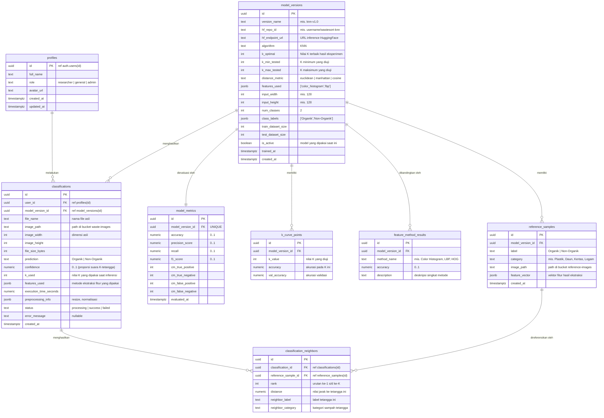

# ERD — Sistem WasteSort
# Klasifikasi Sampah Organik & Non-Organik Berbasis KNN

Dokumen ini berisi *Entity Relationship Diagram* (ERD) untuk sistem **WasteSort**, dirancang untuk arsitektur:

- **Database:** Supabase (PostgreSQL)
- **Penyimpanan File:** Supabase Storage (citra sampah asli & thumbnail referensi)
- **Model KNN:** Di-deploy di HuggingFace (Inference Endpoint / Spaces), database hanya menyimpan **referensi & hasil**, bukan model itu sendiri.

---

## 1. Gambaran Arsitektur Data

```
┌────────────────┐      upload       ┌──────────────────────┐
│  Next.js (UI)  │ ────────────────▶ │  Supabase Storage    │
│                │                   │  (waste-images)      │
│                │      inference    ├──────────────────────┤
│                │ ────────────────▶ │  HuggingFace (KNN)   │
│                │      CRUD         ├──────────────────────┤
│                │ ────────────────▶ │  Supabase Postgres   │
└────────────────┘                   └──────────────────────┘
```

Prinsip desain:
1. **File tidak disimpan di database** — hanya *path* objek Supabase Storage yang disimpan (kolom `*_path`).
2. **Model tidak disimpan di database** — tabel `model_versions` menyimpan referensi `hf_repo_id` ke HuggingFace beserta metrik evaluasinya.
3. **Data latih KNN (referensi tetangga) disimpan di database** melalui tabel `reference_samples`, karena KNN memerlukan akses ke seluruh data latih saat inferensi.
4. Setiap hasil klasifikasi **terikat pada versi model** yang menghasilkannya.

---

## 2. Diagram ERD (Mermaid)



---

## 3. Deskripsi Entitas

### 3.1 `profiles`
Profil pengguna, satu-ke-satu dengan tabel bawaan `auth.users` Supabase.

| Kolom | Tipe | Keterangan |
| :--- | :--- | :--- |
| `id` | `uuid` PK | Sama dengan `auth.users.id` |
| `full_name` | `text` | Nama tampilan |
| `role` | `text` | `researcher`, `general`, `admin` — sesuai target pengguna PRD §3 |
| `avatar_url` | `text` | Opsional |
| `created_at`, `updated_at` | `timestamptz` | Audit |

> Untuk MVP tanpa autentikasi, `classifications.user_id` dibuat *nullable*.

---

### 3.2 `model_versions`
Registri versi model KNN yang di-deploy di HuggingFace.

| Kolom | Tipe | Keterangan |
| :--- | :--- | :--- |
| `id` | `uuid` PK | |
| `version_name` | `text` UNIQUE | mis. `knn-v1.0` |
| `hf_repo_id` | `text` | ID repo HuggingFace |
| `hf_endpoint_url` | `text` | URL endpoint inference |
| `algorithm` | `text` | `KNN` (tetap, sesuai batasan SRS) |
| `k_optimal` | `int` | Nilai K terbaik hasil eksperimen cross-validation |
| `k_min_tested`, `k_max_tested` | `int` | Rentang K yang diuji (mis. 1–20) |
| `distance_metric` | `text` | `euclidean`, `manhattan`, atau `cosine` |
| `features_used` | `jsonb` | Metode ekstraksi fitur yang dipakai |
| `input_width`, `input_height` | `int` | Dimensi preprocessing input (mis. 128×128) |
| `num_classes` | `int` | 2 |
| `class_labels` | `jsonb` | `["Organik", "Non-Organik"]` |
| `train_dataset_size`, `test_dataset_size` | `int` | Jumlah data latih/uji |
| `is_active` | `boolean` | Hanya satu versi aktif (partial unique index) |
| `trained_at`, `created_at` | `timestamptz` | |

---

### 3.3 `model_metrics`
Hasil evaluasi satu versi model (relasi **1:1** dengan `model_versions`). Memenuhi SRS FR-07.

| Kolom | Tipe | Keterangan |
| :--- | :--- | :--- |
| `model_version_id` | `uuid` FK UNIQUE | → `model_versions.id` |
| `accuracy`, `precision_score`, `recall`, `f1_score` | `numeric(5,4)` | Empat metrik wajib |
| `cm_true_positive` … `cm_false_negative` | `int` | Empat sel Confusion Matrix 2×2 |
| `evaluated_at` | `timestamptz` | |

---

### 3.4 `k_curve_points`
Titik-titik kurva K-optimization per nilai K (relasi **1:N** dari `model_versions`). Menjadi sumber data line chart kurva K di halaman Performa (R4).

| Kolom | Tipe | Keterangan |
| :--- | :--- | :--- |
| `model_version_id` | `uuid` FK | → `model_versions.id` |
| `k_value` | `int` | Nilai K yang diuji (UNIQUE bersama `model_version_id`) |
| `accuracy` | `numeric(5,4)` | Akurasi pada nilai K ini |
| `val_accuracy` | `numeric(5,4)` | Akurasi validasi (jika cross-validation) |

---

### 3.5 `feature_method_results`
Hasil perbandingan akurasi per metode ekstraksi fitur. Menjadi sumber data bar chart di halaman Performa (R4).

| Kolom | Tipe | Keterangan |
| :--- | :--- | :--- |
| `model_version_id` | `uuid` FK | → `model_versions.id` |
| `method_name` | `text` | Nama metode (Color Histogram, LBP, HOG, dll.) |
| `accuracy` | `numeric(5,4)` | Akurasi menggunakan metode ini |
| `description` | `text` | Deskripsi singkat metode |

---

### 3.6 `reference_samples`
Data latih KNN yang disimpan sebagai referensi. Karena KNN bersifat *lazy learning*, seluruh data latih diperlukan saat inferensi untuk menghitung jarak.

| Kolom | Tipe | Keterangan |
| :--- | :--- | :--- |
| `id` | `uuid` PK | |
| `model_version_id` | `uuid` FK | → `model_versions.id` |
| `label` | `text` CHECK | `'Organik'` atau `'Non-Organik'` |
| `category` | `text` | Sub-kategori (mis. Plastik, Daun, Kertas, Logam, Kaca) |
| `image_path` | `text` | Path di bucket `reference-images` |
| `feature_vector` | `jsonb` | Vektor fitur hasil ekstraksi (disimpan untuk keperluan visualisasi; komputasi aktual di HF) |
| `created_at` | `timestamptz` | |

---

### 3.7 `classifications` *(tabel inti)*
Setiap satu citra yang diklasifikasikan menghasilkan satu baris.

| Kolom | Tipe | Keterangan |
| :--- | :--- | :--- |
| `id` | `uuid` PK | Dipakai sebagai param rute `/dashboard/classification/[id]` |
| `user_id` | `uuid` FK | → `profiles.id` (nullable di MVP) |
| `model_version_id` | `uuid` FK | → `model_versions.id` |
| `file_name` | `text` | Nama file asli unggahan |
| `image_path` | `text` | Path di bucket `waste-images` |
| `image_width`, `image_height` | `int` | Dimensi citra asli |
| `file_size_bytes` | `int` | |
| `prediction` | `text` CHECK | `'Organik'` atau `'Non-Organik'` |
| `confidence` | `numeric(5,4)` | Proporsi suara K-tetangga (0–1) |
| `k_used` | `int` | Nilai K yang dipakai saat inferensi |
| `features_used` | `jsonb` | Metode ekstraksi fitur yang dipakai |
| `execution_time_seconds` | `numeric(6,3)` | Latensi inference HuggingFace |
| `preprocessing_info` | `jsonb` | mis. `{"resized_to":[128,128],"normalized":true}` |
| `status` | `text` CHECK | `processing` / `success` / `failed` |
| `error_message` | `text` | Diisi jika `failed` |
| `created_at` | `timestamptz` | Untuk sort riwayat & tren harian dashboard |

---

### 3.8 `classification_neighbors`
Detail K-tetangga terdekat untuk setiap hasil klasifikasi. Menjadi sumber data `NeighborViewer` di R2 dan R3.

| Kolom | Tipe | Keterangan |
| :--- | :--- | :--- |
| `id` | `uuid` PK | |
| `classification_id` | `uuid` FK | → `classifications.id` |
| `reference_sample_id` | `uuid` FK | → `reference_samples.id` |
| `rank` | `int` | Urutan tetangga (1 = terdekat, K = terjauh) |
| `distance` | `numeric(10,6)` | Nilai jarak (Euclidean/Manhattan/Cosine) |
| `neighbor_label` | `text` | Label tetangga ini (Organik/Non-Organik) |
| `neighbor_category` | `text` | Sub-kategori sampah tetangga (mis. Daun, Plastik) |

---

## 4. Supabase Storage (Bucket)

| Bucket | Isi | Akses | Direferensikan oleh |
| :--- | :--- | :--- | :--- |
| `waste-images` | Citra sampah yang diunggah pengguna (JPG/PNG/WebP) | Private (signed URL) | `classifications.image_path` |
| `reference-images` | Thumbnail citra data latih KNN (referensi tetangga) | Public read | `reference_samples.image_path` |

**Konvensi path `waste-images`:** `{user_id}/{classification_id}.{ext}`
**Konvensi path `reference-images`:** `{model_version_id}/{label}/{category}/{sample_id}.{ext}`

---

## 5. Relasi & Kardinalitas (Ringkasan)

| Relasi | Kardinalitas | Aturan Hapus |
| :--- | :--- | :--- |
| `profiles` → `classifications` | 1 : N | `ON DELETE SET NULL` |
| `model_versions` → `classifications` | 1 : N | `ON DELETE RESTRICT` |
| `model_versions` → `model_metrics` | 1 : 1 | `ON DELETE CASCADE` |
| `model_versions` → `k_curve_points` | 1 : N | `ON DELETE CASCADE` |
| `model_versions` → `feature_method_results` | 1 : N | `ON DELETE CASCADE` |
| `model_versions` → `reference_samples` | 1 : N | `ON DELETE RESTRICT` |
| `classifications` → `classification_neighbors` | 1 : N | `ON DELETE CASCADE` |
| `reference_samples` → `classification_neighbors` | 1 : N | `ON DELETE RESTRICT` |

---

## 6. Indeks & Kebijakan yang Direkomendasikan

**Indeks:**
- `classifications (created_at DESC)` — sort default Riwayat & tren Dashboard.
- `classifications (prediction)` — filter Organik/Non-Organik di tabel Riwayat.
- `classifications (user_id)` — query per pengguna.
- `classification_neighbors (classification_id, rank)` — query K-tetangga berurutan.
- `reference_samples (model_version_id, label)` — filter referensi per model & kelas.
- Partial unique: `model_versions (is_active) WHERE is_active = true`.
- Unique komposit: `k_curve_points (model_version_id, k_value)`.

**Row Level Security (RLS):**
- `classifications`: pengguna hanya bisa `SELECT/DELETE` baris miliknya (`auth.uid() = user_id`).
- `model_versions`, `model_metrics`, `k_curve_points`, `feature_method_results`: `SELECT` publik (transparansi metrik), tulis hanya `admin`/service role.
- `reference_samples`: `SELECT` publik/authenticated (untuk tampilan K-tetangga).
- Storage `waste-images`: private, signed URL per pengguna.
- Storage `reference-images`: public read (thumbnail referensi ditampilkan di UI).

---

## 7. Pemetaan ERD → Halaman UI (MVP Plan)

| Halaman | Sumber Data |
| :--- | :--- |
| R1 Dashboard | Agregasi `classifications` (count, group by prediction, group by tanggal) + `model_metrics.accuracy` model aktif |
| R2 Klasifikasi Sampah | `INSERT classifications` (status `processing`) → upload Storage → panggil HF KNN → `INSERT classification_neighbors` → `UPDATE classifications` hasil |
| R3 Detail Hasil | `SELECT classifications WHERE id = :id` + `classification_neighbors` + signed URL `waste-images` + path `reference-images` |
| R4 Performa Model | `model_versions (is_active)` + `model_metrics` + `k_curve_points` + `feature_method_results` |
| R5 Riwayat | `SELECT classifications` (paginated, search `file_name`, filter `prediction`) |
| R6 Panduan | Statis (di-hardcode) atau tabel `waste_guides` terpisah (opsional) |
| R7 Tentang | Statis + sebagian info dari `model_versions` aktif |
