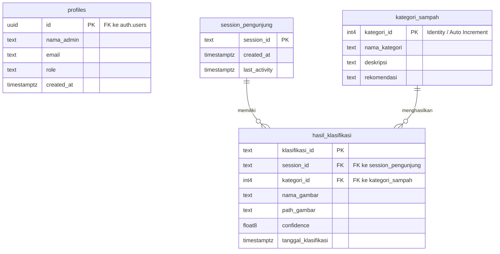

# ERD — Sistem WasteSort
# Klasifikasi Sampah Organik & Non-Organik Berbasis KNN

Dokumen ini berisi *Entity Relationship Diagram* (ERD) untuk sistem **WasteSort** sesuai dengan struktur database.

---

## 1. Diagram ERD (Mermaid)

---

## 2. Deskripsi Entitas

### 2.1 `profiles`
Menyimpan profil pengguna admin. Terhubung langsung dengan autentikasi Supabase.

| Kolom | Tipe | Keterangan |
| :--- | :--- | :--- |
| `id` | `uuid` PK | Primary Key. Foreign Key ke tabel bawaan `auth.users` |
| `nama_admin` | `text` | Nama admin |
| `email` | `text` | Alamat email |
| `role` | `text` | Peran pengguna (mis. admin) |
| `created_at` | `timestamptz` | Waktu dibuat, default `now()` |

---

### 2.2 `session_pengunjung`
Melacak sesi pengguna anonim/pengunjung yang menggunakan aplikasi untuk klasifikasi sampah tanpa login.

| Kolom | Tipe | Keterangan |
| :--- | :--- | :--- |
| `session_id` | `text` PK | Kombinasi huruf & angka acak |
| `created_at` | `timestamptz` | Waktu sesi dimulai, default `now()` |
| `last_activity` | `timestamptz` | Aktivitas terakhir sesi, default `now()` |

---

### 2.3 `kategori_sampah`
Menyimpan data kategori sampah yang didukung oleh sistem (Organik dan Non-Organik).

| Kolom | Tipe | Keterangan |
| :--- | :--- | :--- |
| `kategori_id` | `int4` PK | Auto Increment (Identity) |
| `nama_kategori` | `text` | "Organik" atau "Non-organik" |
| `deskripsi` | `text` | Penjelasan tentang kategori ini |
| `rekomendasi` | `text` | Rekomendasi penanganan sampah |

---

### 2.4 `hasil_klasifikasi`
Menyimpan riwayat dan hasil klasifikasi dari gambar sampah yang diunggah oleh pengunjung.

| Kolom | Tipe | Keterangan |
| :--- | :--- | :--- |
| `klasifikasi_id` | `text` PK | ID dengan format `cls_...` |
| `session_id` | `text` FK | Merujuk ke `session_pengunjung.session_id` |
| `kategori_id` | `int4` FK | Merujuk ke `kategori_sampah.kategori_id` |
| `nama_gambar` | `text` | Nama file gambar |
| `path_gambar` | `text` | URL/Path gambar di Supabase Storage |
| `confidence` | `float8` | Nilai persentase akurasi model |
| `tanggal_klasifikasi` | `timestamptz` | Waktu klasifikasi dilakukan, default `now()` |
